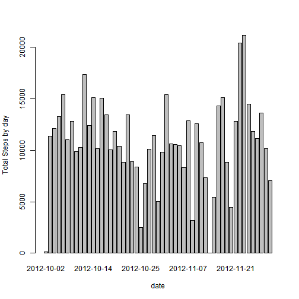
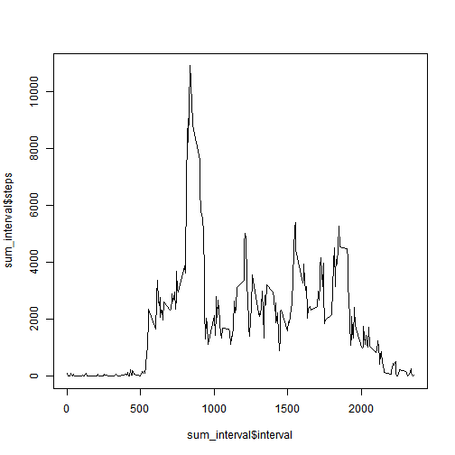
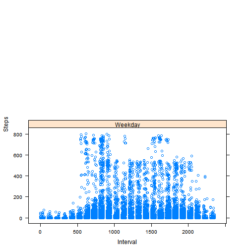

#Assignment 1

## Preparation
Here, I read the data and remove the data with missing value
and the final dataset is named dfgood.


```r
library(lattice)
setwd("d:/")
dat <- read.csv("activity.csv")
good <- !is.na(dat$steps)
dfgood <- dat[good,]
```
## Mean and median by day
Now, I generate a histogram for total steps by day. 

```r
sum_step <- aggregate(steps~ date, sum,data = dfgood)
barplot(sum_step$steps,names.arg = sum_step$date,ylab ="Total Steps by day",xlab="date")
```

 
THe mean value of the total steps by day is  

```r
mean(sum_step$steps)
```

```
## [1] 10766
```
and the Median value is 

```r
median(sum_step$steps)
```

```
## [1] 10765
```

## 5-minutes interval analysis

For 5 minutes time interval

```r
sum_interval <- aggregate(steps~ interval, sum,data = dfgood)
```
the plot of steps number and time interval is 

```r
plot(sum_interval$interval, sum_interval$steps,type='l')
```

 
and the 5-minutes interval with the maximum step number is 

```r
sum_interval$interval[sum_interval$steps== max(sum_interval$steps)]
```

```
## [1] 835
```

## Missing values
In the dataset, there are 

```r
sum(is.na(dat$steps))
```

```
## [1] 2304
```
observations with missing value.

Now we fill all this missing value by the mean step number found at that day

```r
dates <- names(table(dat$date))
date_mean <- c()
data_clean_full <- data.frame()
for (date in dates) { 
  ## calculate mean step number of each day
  date_mean <- mean(dat[dat$date == date,]$steps,na.rm=TRUE) 
  data_clean <- dat[dat$date == date,]
  ## give NA value the mean step number of that day
  for (i in 1: nrow(data_clean)) {
    if(is.na(data_clean[i,][1])) {
      data_clean[i,][1] <- date_mean
    }
  }
  data_clean_full <- rbind(data_clean_full, data_clean)
}
```
Now we get a cleaned dataset named data_clean_full.
Let us replt the histogram

```r
sum_step_full <- aggregate(steps~ date, sum,data = dfgood)
barplot(sum_step_full$steps,names.arg = sum_step_full$date,ylab ="Total Steps by day",xlab="date")
```

 
and the mean and mediam of total steps taken per day is 

```r
mean(sum_step_full$step)
```

```
## [1] 10766
```

```r
median(sum_step_full$step)
```

```
## [1] 10765
```
## weekday weekend analysis
Now we add a new column in dataframe data_clean_full indicating weather that day is weekend or not.


```r
isweekday <- weekdays(as.Date(data_clean_full$date)) !="Saturday" & weekdays(as.Date(data_clean_full$date))!="Sunday"
weekday <- c()
for (i in 1:length(isweekday)){
  if (isweekday[i]) { weekday[i] <- "Weekday" }
  else {weekday[i] <- "Weekend"}
}
dat_clean_wkd <- cbind(data_clean_full,'isweekday' =weekday)
```
then the plot can be obtained

```r
xyplot(steps~interval|isweekday, data= dat_clean_wkd, 
       xlab="Interval", ylab="Steps",layout=c(1,2)) 
```

 
